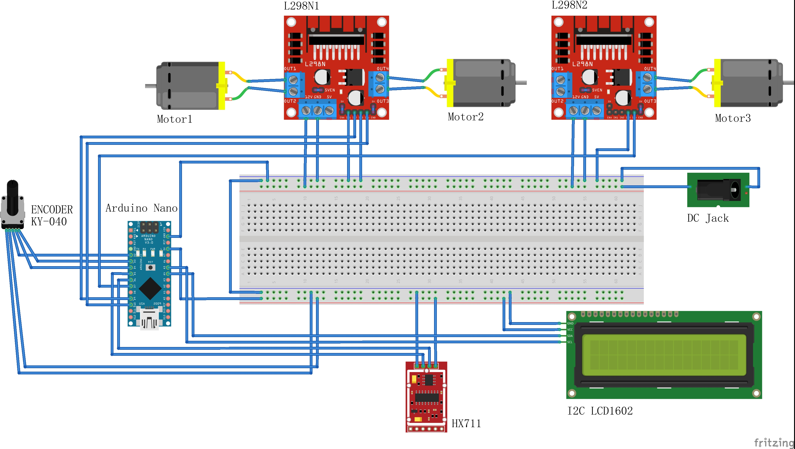

# Cocktail Machine

## Components

1x Arduino UNO/Nano

1x I2C LCD1602

1x Rotary Encoder KY-040 

1x HX711 Load cell

2x L298N Motor Driver

3x Peristaltic Pump

1x DC Jack

1x 15V 5A Power Supply

## Fritzing Configuration

## 教學資源

> 按照幫助程度排序

| 類別/模塊      | 鏈接                                                         | 備注                                             |
| -------------- | ------------------------------------------------------------ | ------------------------------------------------ |
| 項目教程       | [Make Your Own Crude Cocktail Machine](https://www.instructables.com/id/Make-Your-Own-Crude-Cocktail-Machine/) | 完整的項目指導                                   |
| 入門教程       | [佑來老師Arduino教程](https://www.bilibili.com/video/av31147843?p=5) | 序列埠，按鈕，按鈕denounce，模擬信號輸入         |
|                | [Language Reference](https://www.arduino.cc/reference/en)    | Arduino programming language - official document |
| IIC + LCD1602  | [Arduino如何透過I2C控制LCD模組](https://www.youtube.com/watch?v=dCh2YiHROlo) | YouTube                                          |
|                | [Example 液晶顯示LCD](https://www.youtube.com/watch?v=Wb9ipCvpxLQ) | YouTube                                          |
|                | [SunFounder I2C LCD1602](https://www.youtube.com/watch?v=qI4ubkWI_f4) | YouTube                                          |
|                | [模塊教程：液晶LCD602實驗](https://www.bilibili.com/video/BV16441187dg?p=16) |                                                  |
|                | [LiquidCrystal Library](https://www.arduino.cc/en/Reference/LiquidCrystal) | Arduino official document                        |
| HX711          | [How to make a weighing scale with the HX711](https://www.youtube.com/watch?v=S12Mp8gDJmI) | YouTube，校準，調參，LCD顯示                     |
|                | [Arduino Scale With 5kg Load Cell and HX711 Amplifier](https://www.instructables.com/id/Arduino-Scale-With-5kg-Load-Cell-and-HX711-Amplifi/) |                                                  |
| L298n+DC motor | [l298n电机驱动模块](https://www.bilibili.com/video/BV1Xt411372X?from=search&seid=15731004487406671649) |                                                  |
|                | [Controlling DC Motors with the L298N](https://www.youtube.com/watch?v=dyjo_ggEtVU) | YouTube                                          |
| Rotary Encoder | [How Rotary Encoder Works](https://lastminuteengineers.com/rotary-encoder-arduino-tutorial/) | Written tutorial                                 |
|                | [How Rotary Encoder Works](https://www.youtube.com/watch?v=v4BbSzJ-hz4&list=PLN8RmAMYT5ZyFfmzg2emgr1JL6LlmEvgP) | YouTube                                          |
| DC Jack        | [DC电源插座的三个脚怎么理解](https://www.icxbk.com/ask/detail/18652.html) |                                                  |

